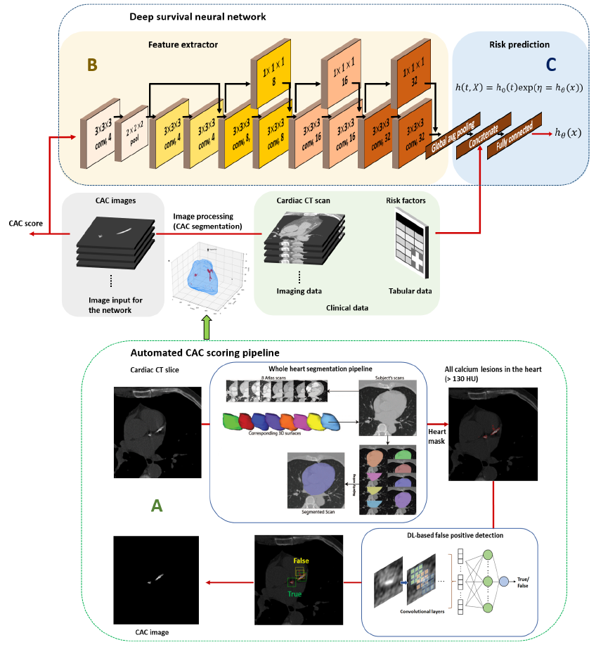

# Deep-survival-NN_CVD-risk-prediction
Multimodal CVD risk prediction with automated CAC scoring and DeepSurv




This repository provides an implementation of a multimodal deep learning framework for cardiovascular disease (CVD) risk prediction that integrates automated coronary artery calcification (CAC) analysis from non-contrast cardiac CT with traditional cardiovascular risk factors using deep survival neural networks.  
The approach enables fully automated risk estimation without human intervention, and was validated in the Rotterdam Study. <br/>
<br/>


## Descriptions
- The repository implements a multimodal pipeline consisting of:
  - automated CAC scoring (whole-heart segmentation + candidate lesion detection + deep learning–based false-positive filtering + Agatston scoring), please refer to our previous paper [our previous paper](https://link.springer.com/chapter/10.1007/978-3-031-87756-8_12) and [implementation](https://github.com/hyunho-mo/auto_cac)
  - CNN-based feature extraction from CAC images
  - DeepSurv-based survival modeling for time-to-event risk prediction
- We validated the approach using a population-based cohort from the Rotterdam Study (n=1,802) with up to 10-year follow-up for incident cardiovascular disease. Note that Rotterdam Study data are not publicly available
- For CAC pipeline development (false-positive detection), we used CAC-annotated CT scans from the public Stanford AIMI COCA dataset (for research use):
  - [Stanford AIMI COCA dataset](https://stanfordaimi.azurewebsites.net/datasets/e8ca74dc-8dd4-4340-815a-60b41f6cb2aa)
- The whole-heart segmentation step uses a multi-atlas segmentation approach as developed and used in the Biomedical Imaging Group Rotterdam (BIGR):
  - [Biomedical Imaging Group Rotterdam (BIGR)](https://bigr.nl/)

## Implemented Methods (as in the paper)
- Cox model using traditional risk factors (Cox_trf)
- DeepSurv using traditional risk factors (DL_trf)
- Cox model using risk factors + semi-automatic CAC scores (Cox_trf+semi)
- Cox model using risk factors + automated CAC scores (Cox_trf+auto)
- DeepSurv using risk factors + automated CAC scores (DL_trf+auto)
- Multimodal deep survival model using CAC images + risk factors (DL_trf+CAC)
- (Optional ablations) multimodal models using heart images or full CT images

## Run (Example Workflow)

### Data preparation 
To generate CSV files in time-to-event representation
```bash
python3 study_population.py
python3 cvd_outcomes.py
python3 trf_predictors_excluded.py
```

To generate hdf5 files containing multimodal data, for deep survival NN
```bash
python3  generate_hdf5_kfold_ten_computed.py
```

### Data preparation 
Python scripts for deep survival NN implementation and experiments are in 
```bash
Deep-survival-NN_CVD-risk-prediction/deep_survival_nn
```
Note that our implementation is based on the code repository for [DAFT](https://github.com/ai-med/DAFT) <br/>


Train multimodal deep survival neural network.
```bash
python3 train_kfold_128.py
```

Test the trained network.
```bash
python3 test_kfold_128.py
```

Evaluate discrimination and calibration performance
```bash
python3 model_comparison_c-statistics_plot_rs_revised.py
python3 corr_plotting_full_fold_merged_ds.py
python3 calibration_plotting_all_methods_recalibration_cv.py
```

## Data Availability
- The Rotterdam Study data used in this work cannot be publicly shared due to privacy regulations and data use agreements.
- Researchers interested in accessing Rotterdam Study data should follow the official data access procedures of the cohort.
- Public datasets such as the Stanford AIMI COCA dataset may be used for CAC-related development and testing.


## References
```
Mo, Hyunho, Maryam Kavousi, Maarten JG Leening, Daniel Bos, and Esther E. Bron. "Cardiovascular Disease Risk Prediction from Cardiac CT and Risk Factors Using Deep Survival Networks." .
```

## Acknowledgments
```
  This work is part of the project MyDigiTwin with project number 628.011.213 of the research programme "COMMIT2DATA - Big Data \& Health" which is partly financed by the Dutch Research Council (NWO). Furthermore, this work used the Dutch national e-infrastructure with the support of the SURF Cooperative using grant no. EINF-7675.
```
